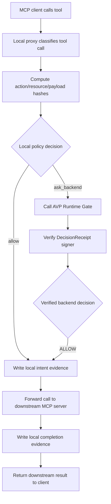
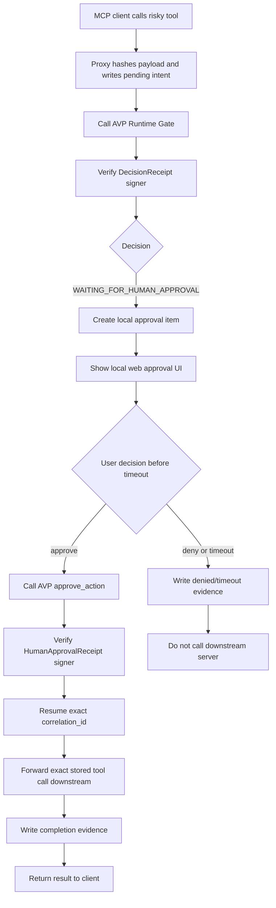
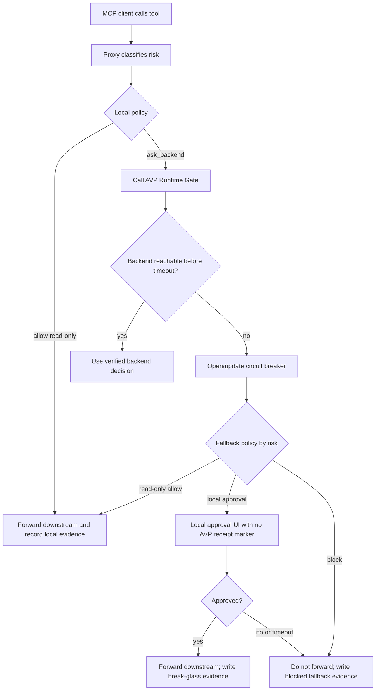

# MCP Proxy v0.1 Plan

Status: P0 design document.

This document is the source of truth for the MCP Proxy v0.1 workstream. It
intentionally does not redefine the existing `agentveil-mcp`
toolbox. The current MCP server remains an explicit AVP action-control toolbox.
The proxy is a separate enforcement integration layer.

## Product Focus

The near-term product priority is Action Control: gating risky agent actions,
routing human approval, and preserving signed evidence.

Agent Economy remains the trust foundation underneath Action Control:

- Agent Economy: identity, reputation, delegation, trust, attestations,
  credentials.
- Action Control: runtime gate, approval, block, receipts, proof.
- MCP Proxy: the first local enforcement integration layer for Action Control.

Customer-facing language should prefer Action Control Plane, Action Gateway, or
Runtime Control Layer. The proxy should not be positioned as automatic
interception outside configured MCP routing, because v0.1 only controls calls
routed through the proxy.

## P0 Scope

P0 is this design document plus terminology polish and flow diagrams. It is not
a greenfield rewrite of the architecture.

P0 must settle the decisions needed before P1 implementation:

- identity model;
- delegation/control-grant compromise;
- privacy contract;
- policy context hash definition;
- receipt verification and trusted signer source;
- approval timeout defaults;
- backend-down fallback behavior;
- MCP protocol scope;
- local policy and `ask_backend` semantics;
- GitHub scenario target;
- Lurkr boundary;
- license/dual-use decision placeholder.

## Current Assets

The current AVP stack already provides:

- Runtime Gate decisions: `ALLOW`, `WAITING_FOR_HUMAN_APPROVAL`, `BLOCK`;
- DelegationReceipt;
- human approval and denial receipts;
- signed DecisionReceipt and ExecutionReceipt flows;
- Proof Packet assembly and offline verification;
- SDK `controlled_action(...)` and approval helpers;
- typed SDK errors;
- production smoke evidence;
- `agentveil-mcp` local/full action-control toolbox;
- `lurkr` as a separate local scanner/top-of-funnel product.

These remain intact. MCP Proxy v0.1 builds beside them rather than changing the
backend/core system first.

## Explicit Non-Goals For v0.1

Do not pull forward:

- full Mode 2/3 gateway platform;
- public SDK `evaluate_action(...)` API;
- full `agentveil policy init` CLI suite;
- managed/customer-hosted gateway;
- hosted generic MCP proxy;
- backend schema changes;
- `payload_hash` inside backend DecisionReceipt;
- backend-signed execution receipt for arbitrary downstream MCP servers;
- AWS/deploy adapters;
- full resources/prompts gating;
- team identity model.

## Architecture Boundary

Add the proxy as a public SDK layer:

```text
agentveil_mcp_proxy/
agentveil-mcp-proxy
```

Do not make the existing `agentveil-mcp` command become a proxy. It remains the
toolbox surface. The new command owns proxy behavior.

The proxy runs locally on the customer's machine:

```text
MCP client -> local AVP MCP Proxy -> downstream MCP server
```

The generic proxy must not become hosted by default. A hosted generic proxy
would process customer tool arguments and downstream credentials, changing AVP's
privacy and compliance posture.

## Identity Model

For v0.1:

```text
one local proxy instance = one AVP identity / DID
```

`agentveil-mcp-proxy init` creates or loads the local proxy identity. Runtime
Gate requests are signed under that identity.

Limitation: team, multi-user, and per-IDE identities are out of scope for v0.1.
If several users share one proxy identity, evidence and reputation are
aggregated on that DID. This must be documented honestly.

## Delegation Model

The current Runtime Gate flow expects a DelegationReceipt. In explicit SDK flows,
the workflow owner issues that receipt. In proxy mode, most users will not
manually issue delegation receipts before using Claude Desktop, Cursor, Cline,
Windsurf, or VS Code.

v0.1 compromise:

```text
agentveil-mcp-proxy init creates a local long-lived control grant
```

The local control grant is implemented with the existing DelegationReceipt
mechanism. It authorizes the local proxy identity to request runtime decisions
for configured downstream tool scopes.

This is not a full multi-party delegation chain. The explicit SDK path remains
the stricter flow for systems that need principal-to-agent delegation evidence.

## Privacy Contract

Default behavior: AVP backend does not receive:

- raw MCP arguments;
- tool outputs;
- prompts;
- source code;
- secrets;
- API tokens;
- private logs.

The backend receives only minimal metadata and hashes:

- action or action hash;
- resource or resource hash;
- environment;
- risk class;
- payload hash;
- policy context hash;
- delegation/control-grant receipt;
- receipt IDs.

Privacy modes:

```yaml
privacy:
  action: plain | redacted | hash
  resource: plain | redacted | hash
  payload: hash_only
  evidence_upload: false
```

`payload` is `hash_only` in v0.1. There is no default mode that sends raw MCP
arguments or tool outputs to AVP.

### Policy Context Hash

`policy_context_hash` is an opaque hash of policy metadata, not user payload.
It is defined as:

```text
sha256(canonical_json({
  "policy_schema_version": 1,
  "policy_id": "...",
  "policy_rule_id": "...",
  "risk_class": "...",
  "decision_mode": "observe|protect|strict"
}))
```

It must not include raw arguments, prompts, outputs, usernames, private
repository text, timestamps with identifying patterns, caller fingerprint, or
other business-sensitive per-call content.

## Trusted Signer Source And Receipt Verification

The proxy must verify inbound AVP receipts before treating them as trusted
evidence.

Requirement:

```text
Proxy MUST verify receipt Ed25519 signatures against pinned trusted_signer_did
values before storing receipts as verified evidence or acting on a receipt as
authoritative.
```

Use existing SDK verification helpers such as `verify_signed_jcs(...)` and
`verify_proof_packet(...)`.

`trusted_signer_did` source:

- `agentveil-mcp-proxy init` writes `avp.trusted_signer_dids` into the local
  config for known AVP environments such as `https://agentveil.dev`.
- The trusted signer DID must be pinned in local config or an SDK-bundled
  environment profile. It must not be learned from the same receipt response
  being verified.
- Manual override is allowed for private/customer-hosted AVP environments.
- If no trusted signer is configured, `agentveil-mcp-proxy doctor` fails and
  risky enforcement must not run in verified mode.

If verification fails:

- do not execute the risky downstream action;
- mark the decision as untrusted;
- emit a local security/evidence event;
- do not fabricate an AVP receipt.

## Evidence Model

For generic downstream MCP execution in v0.1:

- backend-signed: DecisionReceipt;
- backend-signed: HumanApprovalReceipt, when approval is required;
- local evidence: downstream execution intent/completion, payload hash, result
  hash, correlation ID, and receipt digests.

Do not claim that backend-signed ExecutionReceipt proves arbitrary external MCP
execution. That is only honest for AVP-managed execution adapters. Generic MCP
execution needs either local proxy evidence in v0.1 or a later backend schema
bump/adapter model.

## Payload Binding

The proxy canonicalizes MCP tool arguments and computes:

- `payload_hash`;
- `action_hash`, when configured;
- `resource_hash`, when configured.

Before forwarding to a downstream MCP server, the proxy writes local intent
evidence:

- correlation ID;
- downstream server name;
- tool name or tool hash;
- action/resource representation according to privacy config;
- payload hash;
- policy rule ID;
- decision path;
- AVP DecisionReceipt digest when available.

After downstream execution, it writes completion evidence:

- correlation ID;
- completion status;
- result hash;
- error class, when present;
- timestamp;
- local evidence schema version.

Limitation: in v0.1 `payload_hash` is not inside the backend DecisionReceipt.
The proxy can link decision evidence to local execution evidence, but full
cryptographic payload binding inside DecisionReceipt requires a later backend
schema bump.

## Observe Mode Evidence

Observe mode must never block, hold, or mutate downstream execution. It records
what the proxy would have done under enforcement.

Observe-mode evidence shape:

```json
{
  "schema_version": 1,
  "mode": "observe",
  "enforced": false,
  "correlation_id": "...",
  "downstream_server": "...",
  "tool_name_or_hash": "...",
  "risk_class": "read|write|destructive|production|financial|unknown",
  "would_decision": "allow|approval|block|ask_backend",
  "actual_action": "forwarded",
  "payload_hash": "sha256:...",
  "policy_id": "...",
  "policy_rule_id": "...",
  "backend_decision": null,
  "decision_receipt_sha256": null
}
```

If observe mode calls AVP for advisory evaluation, `backend_decision` and
`decision_receipt_sha256` may be populated only after receipt verification. AVP
backend failures in observe mode are recorded but do not block downstream calls.

## Internal Local Policy

v0.1 needs local policy, but not as a public SDK `evaluate_action(...)` API.

Local policy is internal to the proxy:

```text
classify tool call -> local policy -> allow / ask_backend / approval / block
```

Reasons:

- privacy: avoid backend calls for obvious read-only work;
- speed: make local decisions when safe;
- reliability: fallback when AVP backend is unavailable;
- cost/load control: do not call `/v1/runtime/evaluate` for every read.

Public `evaluate_action(...)` remains future work.

Policy schema is versioned from day one:

```yaml
proxy_config_schema_version: 1
policy_schema_version: 1
```

Policy decisions:

- `allow`: execute locally without backend evaluation;
- `approval`: require local approval before forwarding;
- `block`: do not forward;
- `observe`: record evidence only, then forward;
- `ask_backend`: call AVP Runtime Gate for the final enforcement decision.

### `ask_backend` Semantics

`ask_backend` is not an allow decision. It means local policy cannot or should
not decide alone.

In protect/strict modes:

1. proxy calls AVP Runtime Gate;
2. verified `ALLOW` continues to downstream;
3. verified `WAITING_FOR_HUMAN_APPROVAL` enters approval flow;
4. verified `BLOCK` stops the downstream call;
5. backend timeout/unavailability uses fallback policy.

In observe mode:

1. proxy may call AVP Runtime Gate as advisory;
2. backend response is recorded if verified;
3. backend failure is recorded;
4. downstream call still proceeds.

Risk classes:

- `read`;
- `write`;
- `destructive`;
- `production`;
- `financial`;
- `unknown`.

Conflict rule:

```text
stricter wins by default
```

User overrides may weaken built-in policy only when explicitly marked as an
intentional override.

Malformed hot-reload behavior:

- keep last-good policy;
- emit warning/evidence event;
- do not apply malformed policy;
- do not silently fail open.

## TTL And Caching Defaults

Caching must not weaken approval semantics.

Default TTLs:

- backend health circuit breaker open interval: 60 seconds;
- downstream `tools/list`/classification cache: 300 seconds, invalidated by MCP
  tool-change notifications or proxy config reload;
- AVP identity/preflight cache: 300 seconds;
- trusted signer config: pinned until config change, not network-refreshed
  during runtime enforcement;
- exact `ALLOW` decision cache: disabled by default.

If an `ALLOW` decision cache is later enabled, it must be opt-in, limited to
read-only deterministic calls, include payload hash and policy rule ID in the
cache key, and use a maximum TTL of 60 seconds. Approval decisions, denials,
destructive actions, production actions, and financial actions must not be
reused from cache.

## Backend-Down Fallback

AVP unavailability must not globally stop customer work.

Default balanced fallback:

- read-only: allow locally;
- low-risk write: local approval;
- high-risk/destructive/production/financial: block or local approval by policy;
- unknown: local approval.

Runtime behavior:

- backend timeout: 1-2 seconds;
- circuit breaker opens after repeated failures;
- local break-glass evidence is written;
- UI clearly marks that no AVP signed gate receipt exists;
- never generate fake AVP receipts.

Fallback behavior is policy-driven and must be explicit in config.

## Approval UX

CLI-only approval is not sufficient.

v0.1 minimum:

- local web UI bound to `127.0.0.1`;
- browser or OS notification where possible;
- CLI fallback;
- approval timeout handling.

Default timeout:

```yaml
approval_timeout_seconds: 300
on_timeout: deny
```

Per-policy override:

```yaml
on_timeout: deny | hang
```

Default must be deny for destructive, production, and financial actions. `allow` is
not supported because inaction must not authorize downstream execution.

## Minimal Proxy CLI

v0.1 needs only the minimal proxy CLI, not the full future policy CLI suite.

Required commands:

```text
agentveil-mcp-proxy init
agentveil-mcp-proxy run
agentveil-mcp-proxy doctor
```

Later onboarding commands may include:

```text
agentveil-mcp-proxy patch claude-desktop
agentveil-mcp-proxy smoke-test
```

Full `agentveil policy init` and policy-management CLI commands remain later
work.

## MCP Protocol Scope

v0.1 scope:

- `tools/list`: pass-through/mirror;
- `tools/call`: gated;
- `resources/read`: observe/pass-through initially;
- `prompts/get`: observe/pass-through initially;
- tool-change notifications: best-effort mirror;
- streaming: only after the lifecycle is safe and testable.

The v0.1 proxy must not claim full MCP protocol enforcement beyond `tools/call`.

## Flow Diagrams

### ALLOW Path



### WAITING, Approve, Resume Path



### Backend-Down Fallback Path



## Implementation Slices

Recommended order:

1. P0: commit and polish this document as `docs/MCP_PROXY_V0_1_PLAN.md`.
2. P1: config schema and internal local policy engine.
3. P2: minimal CLI: `init`, `run`, `doctor`.
4. P3: MCP pass-through skeleton.
5. P4: tool classification and privacy hashing.
6. P5: Runtime Gate integration.
7. P6.0: approval UX design contract.
8. P7a: durable approval/evidence core.
9. P6: local web approval UX implementation.
10. P7b: evidence proof and export hardening.
11. P8: backend fallback and circuit breaker.
12. P9: concurrency and correlation handling.
13. P10.5: five-minute onboarding flow.
14. P11: GitHub scenario, docs, and release gate.

## Evidence Inspection CLI

Evidence store acceptance requires inspection commands:

```text
agentveil-mcp-proxy events --tail
agentveil-mcp-proxy events --since 1h --blocked-only
agentveil-mcp-proxy events --action fs.delete
agentveil-mcp-proxy approvals --pending
```

Without this, local evidence is not debuggable.

## P10.5 Onboarding Flow

Target onboarding:

```text
pip install agentveil[proxy]
agentveil-mcp-proxy init
agentveil-mcp-proxy patch claude-desktop
agentveil-mcp-proxy smoke-test
agentveil-mcp-proxy run
```

Acceptance:

- user can get from zero to a gated risky tool in about five minutes;
- config patch is reversible;
- smoke-test verifies that the gate fires.

## P11 Release Gate

Before public release positioning, run load smoke against
`agentveil.dev` using a simulated proxy profile:

```text
N agents x M calls/min
```

Hold release if:

- Runtime Gate p95 latency exceeds 500 ms under target load; or
- HTTP 429 rate exceeds 1%; or
- approval/receipt endpoints show sustained error spikes.

Measure:

- `/v1/runtime/evaluate`;
- approval endpoints;
- receipt fetch;
- API CPU/memory;
- Redis and database metrics;
- 429 rate;
- p95/p99 latency.

The proxy should not call the backend for every read-only action by default.

## GitHub Scenario Target

Use the official GitHub MCP server for the first validation scenario:

```text
github/github-mcp-server
```

Pin version or container digest where possible. Do not build the primary scenario
around an unvetted community fork.

Scenario behavior:

- GitHub read operation: allow;
- create/update/merge/write operation: approval;
- dangerous/admin/delete operation: approval or block;
- local evidence plus verified AVP decision/approval receipt preserved.

## Lurkr Boundary

Lurkr remains a separate top-of-funnel product:

- package: `lurkr`;
- repo: `agentveil-protocol/lurkr`;
- local-only scanner;
- no runtime enforcement;
- best-effort bypass detection.

Lurkr is outside the MCP adapter v0.1 polishing scope. It can later generate
recommended proxy configs and policies, but the proxy must not require Lurkr
for core runtime operation and this v0.1 sequence does not include a Lurkr
integration step.

A future Lurkr-to-proxy bridge would be a separate opt-in slice added only if
customer demand surfaces. Lurkr remains an orthogonal pre-deployment scanner,
not a runtime dependency for the MCP Proxy.

Lurkr bypass detection is advisory. It can flag direct MCP config entries that
avoid the proxy, but authoritative enforcement requires routing through the
proxy.

## License And Dual-Use Placeholder

Before the first public proxy narrative, decide whether MIT proxy code in the
public SDK is intentional.

Options:

- keep proxy MIT in public SDK for adoption/ecosystem growth;
- move proxy elsewhere or use a different licensing model before public beta.

This is not a P1 implementation blocker, but it must be resolved before public
proxy positioning.

## Test Plan

Minimum tests before beta:

- `tools/list` pass-through;
- `tools/call` allow path;
- `tools/call` approval path;
- `tools/call` block path;
- backend unavailable fallback;
- raw args never sent to backend;
- payload hash stable across equivalent JSON;
- secret redaction in logs;
- concurrent approvals;
- wrong approval ID cannot resume another call;
- downstream server unreachable;
- proxy crash mid-call recovery;
- local evidence inspection commands.

Live smoke:

- configure Claude Desktop/Cursor-style client through proxy;
- downstream GitHub MCP read operation allowed;
- downstream GitHub write operation requires approval;
- approval resumes exact call;
- denial blocks exact call;
- backend outage fallback verified;
- evidence and receipts inspectable.

## Final Acceptance For P0

P0 is complete when this document is committed and review confirms:

- no conflicting parallel design doc exists;
- identity/delegation/privacy/evidence/fallback choices are explicit;
- TTL, trusted signer source, observe-mode evidence, and `ask_backend`
  semantics are specified;
- diagrams cover ALLOW, approval/resume, and backend-down fallback;
- v0.1 non-goals protect the project from scope creep.
